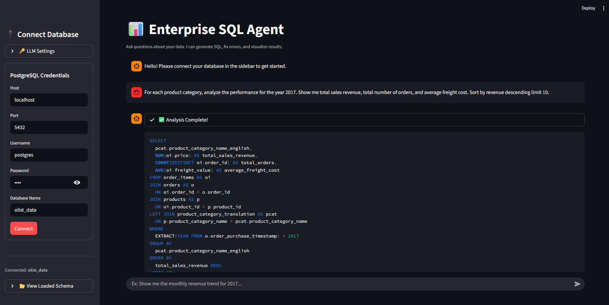
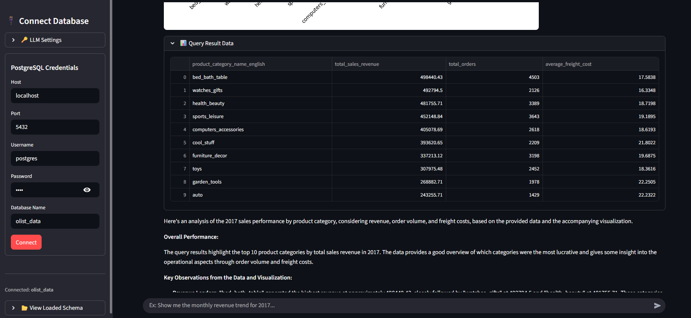
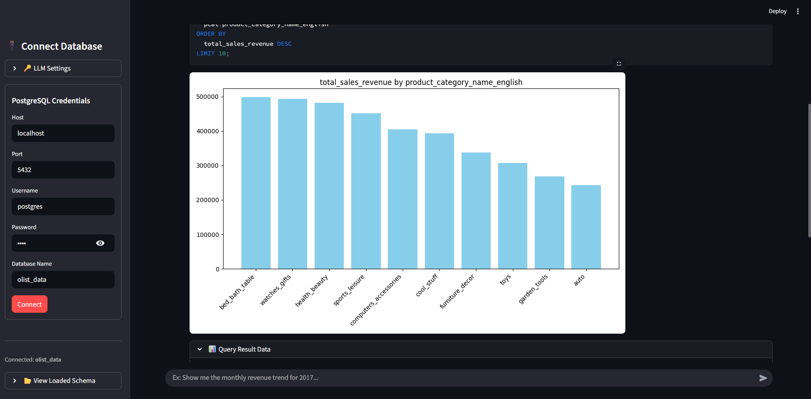

# 📊 Enterprise AI SQL Agent

A powerful, agentic SQL assistant that transforms natural language into executable SQL queries, recovers from errors, and generates dynamic visualizations. Built with **LangChain**, **LangGraph**, and **Google Gemini**.

---

## 🚀 Overview

The **Enterprise AI SQL Agent** is designed to bridge the gap between non-technical users and complex databases. Users can ask questions in plain English (e.g., *"Show me the monthly revenue for 2017"*), and the agent will:
1.  **Plan** the correct SQL query based on the schema.
2.  **Execute** the query against the database.
3.  **Self-Heal**: If the query fails, it analyzes the error and retries.
4.  **Visualize**: Automatically determines the best chart type (Bar, Line, Pie, Scatter) and renders it.
5.  **Analyze**: Provides a databacked summary of the results.

---

## ✨ Key Features

-   **🤖 Agentic Workflow**: Uses `LangGraph` to manage state, allowing for loops, error correction, and multi-step reasoning.
-   **🛡️ Robust Error Handling**: If an SQL query fails, the agent reads the error message, consults the schema, and fixes the query automatically.
-   **📈 Intelligent Visualization**: The agent decides *if* a graph is needed and *what type* works best, then generates it using `Matplotlib`.
-   **🔌 Dynamic Schema Loading**: Connect to any PostgreSQL database; the agent reads the schema in real-time.
-   **🛠️ Full Observability**: Integrated with **LangSmith** for deep tracing and debugging of LLM runs.

---

## 📸 How It Works

### 1. Smart Interface
Enter your natural language query in the chat interface. The sidebar allows you to connect to your PostgreSQL database and configure LangSmith tracing.


### 2. Intelligent Retrieval
The agent converts your text to SQL, executes it, and retrieves the raw data.


### 3. Automated Visualization
If appropriate, the data is automatically visualized. For example, a time-series query will generate a line chart.


### 4. Insightful Analysis
Finally, the agent provides a comprehensive summary and analysis of the data, referencing both the raw numbers and the visualization.


---

## 🏗️ Tech Stack

-   **LLM**: Google Gemini 2.0 Flash
-   **Frameworks**: LangChain, LangGraph
-   **Backend**: Python, SQLAlchemy, PostgreSQL
-   **Frontend**: Streamlit
-   **Observability**: LangSmith

---

## ⚙️ Setup & Installation

### Prerequisites
-   Python 3.10+
-   PostgreSQL Database
-   Google Cloud API Key (Gemini)
-   (Optional) LangSmith API Key

### Installation

1.  **Clone the repository**
    ```bash
    git clone https://github.com/ParthZadeshwariya/text-to-sql.git
    cd text-to-sql
    ```

2.  **Install Dependencies**
    ```bash
    pip install -r requirement.txt
    ```

3.  **Environment Configuration**
    Create a `.env` file in the root directory:
    ```env
    GOOGLE_API_KEY=your_google_api_key
    
    # Optional: For Tracing
    LANGCHAIN_TRACING_V2=true
    LANGCHAIN_API_KEY=your_langsmith_key
    LANGCHAIN_PROJECT=text-to-sql
    ```

4.  **Run the Application**
    ```bash
    streamlit run app.py
    ```

---

